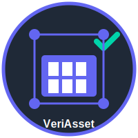

# VeriAssets 🏦✨

<p align="center">
  
</p>

<p align="center">
  
</p>

**AI-Verified Real-World Asset Marketplace & Launchpad on Qubic**

[](https://qubic.org)
[](https://qubic.org)

---

## 📖 Table of Contents

1. [What is VeriAssets?](#-what-is-veriassets)
2. [The Problem We Solve](#-the-problem-we-solve)
3. [How It Works](#-how-it-works)
4. [Key Features](#-key-features)
5. [Architecture](#-architecture)
6. [Tech Stack](#-tech-stack)
7. [Getting Started](#-getting-started)
8. [API Documentation](#-api-documentation)
9. [EasyConnect Webhooks](#-easyconnect-webhooks)
10. [Nostromo Governance](#-nostromo-governance)
11. [Fee Structure](#-fee-structure)
12. [Security](#-security)
13. [Roadmap](#-roadmap)
14. [Contributing](#-contributing)

---

## 🌟 What is VeriAssets?

**VeriAssets** is a marketplace where you can buy, sell, and trade **real-world assets** (like real estate, carbon credits, or treasury bonds) as digital tokens on the blockchain.

### In Simple Terms

Imagine you want to invest in a building worth $1 million, but you only have $100. Normally, that's impossible. With VeriAssets:

1. The building gets "tokenized" (split into small digital pieces)
2. You can buy just $100 worth of that building
3. You truly own that fraction and can sell it anytime
4. Everything is verified by AI to ensure it's legitimate

**Think of it like:** Buying stocks, but instead of company shares, you're buying pieces of real-world things like properties, carbon credits, or government bonds.

---

## 🎯 The Problem We Solve

### Why Do We Need VeriAssets?

| Problem | Traditional Way | VeriAssets Solution |
|---------|-----------------|---------------------|
| **High Investment Minimums** | Need $100,000+ to invest in real estate | Start with as little as $10 |
| **Slow Verification** | Document checking takes weeks | AI verifies in seconds |
| **No Liquidity** | Assets locked for years | Trade 24/7 with instant settlement |
| **Trust Issues** | How do you know documents are real? | AI-powered verification with confidence scores |
| **Geographic Barriers** | Can't easily invest globally | Access worldwide assets from anywhere |

### Real-World Example

> **Without VeriAssets:** You want to invest in carbon credits to help the environment. You'd need to find a broker, pay high fees, wait weeks for verification, and lock up your money for years.
>
> **With VeriAssets:** Browse verified carbon credits, buy $50 worth in seconds, and sell anytime you want. Simple.

---

## 🔄 How It Works

### For Asset Owners (People Who Want to Sell Assets)

```
Step 1: Upload Asset Documents
         ↓
Step 2: AI Verifies Authenticity (Gemini 1.5 Flash)
         ↓
Step 3: Community Votes to Approve (Nostromo Governance)
         ↓
Step 4: Launch IPO via Dutch Auction
         ↓
Step 5: Asset is Now Tradeable on Marketplace
```

**Example:** You own a property worth $500,000. You upload the title deed, AI verifies it's real (95% confidence score), the community approves it, and now 5,000 people can each buy $100 tokens representing a piece of your property.

### For Investors (People Who Want to Buy Assets)

```
Step 1: Connect Your Qubic Wallet
         ↓
Step 2: Browse AI-Verified Assets
         ↓
Step 3: Buy Tokens (Fractional Ownership)
         ↓
Step 4: Hold, Sell, or Trade Anytime
         ↓
Step 5: Receive Returns Based on Asset Performance
```

**Example:** You find a carbon credit project you like. It shows "AI Verified ✓" with a 98% confidence score. You buy $50 worth. Later, when the price goes up, you sell for $75. That's a $25 profit!

---

## ✨ Key Features

### 🤖 AI-Powered Verification

**What is it?** Our system uses **Google Gemini 1.5 Flash** (a powerful AI) to automatically check if documents are real.

**How does it work?**
- You upload a document (PDF, image, data file)
- AI analyzes it for authenticity
- Returns a confidence score (0-100%)
- Documents scoring 95%+ are auto-approved
- Prevents fraud before it happens

**Why is this important?** No more waiting weeks for manual verification. No more worrying if a document is fake.

### 🏦 Asset Types Supported

| Asset Type | What It Is | Example |
|------------|------------|---------|
| **Carbon Credits** | Certificates proving environmental offset | "Rainforest Protection Credit" |
| **Real Estate** | Tokenized property ownership | "Manhattan Office Building" |
| **Treasury Bonds** | Government-backed securities | "US 10-Year Treasury" |
| **Commodities** | Physical goods certificates | "Gold Storage Certificate" |

### 🗳️ Community Governance (Nostromo)

**What is it?** Every new asset listing is voted on by the community before it can be traded.

**How does it work?**
1. Asset owner submits a proposal to list their asset
2. Token holders vote FOR or AGAINST
3. Need 100+ votes with 2:1 approval ratio (e.g., 200 FOR, 100 AGAINST)
4. If approved, the asset can be listed

**Why is this important?** Ensures only quality, legitimate assets are listed. The community protects itself from bad actors.

### 🏷️ Dutch Auction IPO

**What is it?** A fair way to launch new assets where the price starts high and decreases over time.

**How does it work?**
```
Price starts at $150
         ↓ (time passes)
Price drops to $125
         ↓ (time passes)
Price drops to $100
         ↓
You decide to buy at $100
```

**Why is this important?** 
- No front-running (people can't jump ahead in line)
- Everyone gets the same fair opportunity
- Market naturally finds the right price

### ⚡ Instant Transactions

**Built on Qubic blockchain** which offers:
- Sub-second transaction finality (your trade completes almost instantly)
- 150,000+ transactions per second capacity
- Near-zero fees
- No failed transactions

**Comparison:**
| Feature | VeriAssets (Qubic) | Traditional Finance | Other Blockchains |
|---------|-------------------|--------------------|--------------------|
| Speed | < 1 second | 2-3 business days | 10-60 seconds |
| Fees | ~$0.001 | $10-50 | $5-200 |
| Availability | 24/7/365 | Business hours | 24/7 |

### 🔗 EasyConnect Automation

**What is it?** Connect VeriAssets to your favorite apps like Discord, Slack, or email.

**Examples of what you can do:**
- Get a Discord message when your trade executes
- Receive email alerts when new carbon credits are listed
- Automatically log all trades to a Google Sheet
- Set up custom notifications for price changes

---

## 🏗️ Architecture

### Project Structure (Simplified)

```
VeriAssets/
├── backend/                 # The "brain" - handles data and business logic
│   ├── app/
│   │   ├── api/v1/         # API endpoints (how frontend talks to backend)
│   │   ├── core/           # Configuration settings
│   │   ├── db/             # Database models (how data is stored)
│   │   ├── models/         # Data structures
│   │   └── services/       # External integrations (AI, Qubic, etc.)
│   └── Dockerfile          # Container configuration
│
├── frontend/               # The "face" - what users see and interact with
│   ├── src/
│   │   ├── app/           # Pages (Home, Marketplace, Dashboard, etc.)
│   │   ├── components/    # Reusable UI pieces (buttons, cards, etc.)
│   │   ├── hooks/         # Custom React functionality
│   │   └── lib/           # Utilities and helpers
│   └── Dockerfile         # Container configuration
│
└── docker-compose.yml     # Runs everything together
```

### How the Parts Connect

```
┌─────────────┐     ┌─────────────┐     ┌─────────────┐
│   Frontend  │────▶│   Backend   │────▶│  Database   │
│  (Next.js)  │     │  (FastAPI)  │     │   (Neon)    │
└─────────────┘     └─────────────┘     └─────────────┘
                           │
                    ┌──────┴──────┐
                    ▼             ▼
            ┌─────────────┐ ┌─────────────┐
            │  Gemini AI  │ │   Qubic     │
            │ (Verify)    │ │ (Blockchain)│
            └─────────────┘ └─────────────┘
```

---

## 🛠️ Tech Stack

### Backend (Server-Side)

| Technology | What It Does | Why We Use It |
|------------|--------------|---------------|
| **FastAPI** | Web framework | Super fast, automatic documentation |
| **SQLModel** | Database ORM | Easy database queries with Python |
| **Neon** | Database | Serverless Postgres, scales automatically |
| **Google Gemini** | AI service | Document verification |
| **Qubic RPC** | Blockchain connection | Talk to Qubic network |

### Frontend (User Interface)

| Technology | What It Does | Why We Use It |
|------------|--------------|---------------|
| **Next.js 15** | React framework | Fast page loads, great SEO |
| **Clerk** | Authentication | Secure login, Google sign-in |
| **TanStack Query** | Data fetching | Automatic caching, real-time updates |
| **Tailwind CSS** | Styling | Beautiful UI, fast development |
| **Zustand** | State management | Simple, lightweight data management |

### Infrastructure

| Technology | What It Does | Why We Use It |
|------------|--------------|---------------|
| **Docker** | Containers | Run anywhere, consistent environments |
| **Redis** | Caching | Fast data access, rate limiting |
| **uv** | Package manager | 10x faster than pip |

---

## 🚀 Getting Started

### What You'll Need

Before starting, make sure you have:

- **Node.js 20+** - [Download here](https://nodejs.org/)
- **Python 3.11+** - [Download here](https://python.org/)
- **Docker & Docker Compose** - [Download here](https://docker.com/)
- **Clerk account** - [Sign up free](https://clerk.dev/) (for user authentication)
- **Google AI Studio API key** - [Get one here](https://makersuite.google.com/) (for AI verification)
- **Neon database** - [Sign up free](https://neon.tech/) (for data storage)

### Step 1: Download the Code

```bash
# Clone the repository to your computer
git clone https://github.com/yourusername/veriassets.git

# Navigate into the project folder
cd veriassets
```

### Step 2: Set Up the Backend

```bash
# Go to the backend folder
cd backend

# Create your configuration file
cp .env.example .env

# Open .env in a text editor and fill in your API keys:
# - DATABASE_URL (from Neon)
# - CLERK_SECRET_KEY (from Clerk dashboard)
# - GEMINI_API_KEY (from Google AI Studio)

# Install Python dependencies
uv pip install -r pyproject.toml

# Set up the database tables
uv run alembic upgrade head

# Start the backend server
uv run uvicorn app.main:app --reload
```

**You should see:** `Uvicorn running on http://127.0.0.1:8000`

### Step 3: Set Up the Frontend

Open a **new terminal window**:

```bash
# Go to the frontend folder
cd frontend

# Create your configuration file
cp .env.local.example .env.local

# Open .env.local and fill in your Clerk keys:
# - NEXT_PUBLIC_CLERK_PUBLISHABLE_KEY
# - CLERK_SECRET_KEY

# Install Node.js dependencies
npm install

# Start the frontend server
npm run dev
```

**You should see:** `Ready on http://localhost:3000`

### Step 4: Open the Application

1. Open your browser
2. Go to `http://localhost:3000`
3. You should see the VeriAssets homepage!

### Alternative: Docker (One-Click Setup)

If you prefer Docker, just run:

```bash
# Build and start all services
docker-compose up -d

# View logs (optional)
docker-compose logs -f
```

This starts everything automatically!

---

## 📚 API Documentation

### Accessing the Docs

Once the backend is running, you can explore the API:

- **Interactive Docs (Swagger):** `http://localhost:8000/docs`
- **Alternative Docs (ReDoc):** `http://localhost:8000/redoc`

### Main API Endpoints

| Endpoint | Method | What It Does |
|----------|--------|--------------|
| `/api/v1/rwa` | GET | List all assets |
| `/api/v1/rwa` | POST | Create a new asset |
| `/api/v1/rwa/{id}` | GET | Get details of one asset |
| `/api/v1/rwa/{id}/verify` | POST | Trigger AI verification |
| `/api/v1/trade` | GET | List all trades |
| `/api/v1/trade` | POST | Execute a trade |
| `/api/v1/nostromo/proposals` | GET | List governance proposals |
| `/api/v1/nostromo/proposals` | POST | Create a new proposal |
| `/api/v1/nostromo/proposals/{id}/vote` | POST | Vote on a proposal |
| `/api/v1/nostromo/ipo/{id}/bid` | POST | Place a Dutch auction bid |
| `/api/v1/stats` | GET | Get platform statistics |

### Example API Call

**Get all verified assets:**

```bash
curl http://localhost:8000/api/v1/rwa?status=verified
```

**Response:**
```json
{
  "assets": [
    {
      "id": "abc123",
      "name": "Amazon Rainforest Carbon Credit",
      "type": "carbon_credit",
      "price": 125.50,
      "verification_score": 98,
      "status": "verified"
    }
  ]
}
```

---

## 🔄 EasyConnect Webhooks

### What Are Webhooks?

Webhooks are automatic notifications sent to external services when something happens in VeriAssets.

### Available Events

| Event | When It Triggers | Example Use Case |
|-------|-----------------|------------------|
| `RWA_CREATED` | New asset submitted | Alert moderators in Slack |
| `RWA_VERIFIED` | AI verification complete | Notify asset owner via email |
| `TRADE_COMPLETED` | Trade executed | Log to accounting system |
| `PROPOSAL_CREATED` | New governance proposal | Post to Discord community |
| `PROPOSAL_VOTED` | Someone votes | Update live vote counter |
| `IPO_BID_FILLED` | Dutch auction bid fills | Send confirmation email |

### Setting Up a Webhook

1. Go to **Settings** in your VeriAssets dashboard
2. Click **Add Webhook**
3. Enter your webhook URL (from Make.com, Zapier, or your own server)
4. Select which events to receive
5. Click **Save**

### Example: Discord Alert for New Trades

Using Make.com:
1. Create a new scenario
2. Add VeriAssets webhook trigger
3. Select `TRADE_COMPLETED` event
4. Add Discord action
5. Configure message template

Now every trade triggers a Discord notification!

---

## 🗳️ Nostromo Governance

### How Governance Works

VeriAssets uses **Nostromo**, Qubic's decentralized governance system, to let the community decide which assets get listed.

### The Governance Process

```
┌─────────────────────────────────────────────────────────────┐
│  1. SUBMIT PROPOSAL                                         │
│     Asset owner submits listing request with documents      │
└─────────────────────────────────────────────────────────────┘
                            ↓
┌─────────────────────────────────────────────────────────────┐
│  2. AI VERIFICATION                                         │
│     Gemini AI analyzes documents, returns confidence score  │
└─────────────────────────────────────────────────────────────┘
                            ↓
┌─────────────────────────────────────────────────────────────┐
│  3. COMMUNITY VOTING                                        │
│     Token holders vote FOR or AGAINST for 7 days           │
└─────────────────────────────────────────────────────────────┘
                            ↓
┌─────────────────────────────────────────────────────────────┐
│  4. THRESHOLD CHECK                                         │
│     Needs: 100+ votes AND 2:1 FOR/AGAINST ratio            │
└─────────────────────────────────────────────────────────────┘
                            ↓
┌─────────────────────────────────────────────────────────────┐
│  5. DUTCH AUCTION IPO                                       │
│     If approved, asset enters 24-hour IPO                   │
└─────────────────────────────────────────────────────────────┘
```

### Proposal Types

| Type | Description | Example |
|------|-------------|---------|
| **Asset Listing** | Add new asset to marketplace | "List Carbon Credit Project X" |
| **Parameter Change** | Modify platform settings | "Reduce trading fee to 0.2%" |
| **Feature Request** | Propose new functionality | "Add price alerts" |
| **Treasury** | Allocate community funds | "Fund marketing campaign" |
| **Emergency** | Urgent changes | "Pause trading for security fix" |

### Voting Power

Your voting power depends on your VERI token holdings:
- 1 VERI = 1 Vote
- Votes are weighted by token balance at proposal creation
- You can delegate votes to others

---

## 🔥 Fee Structure

### Trading Fees

| Action | Fee | Where Does It Go? |
|--------|-----|-------------------|
| **Buy/Sell Trade** | 0.3% | 100% Burned (removed from supply) |
| **IPO Participation** | 1% | Treasury (for platform development) |
| **AI Verification** | Free | Covered by platform |
| **Governance Voting** | Free | No cost to vote |

### Example

You buy $1,000 worth of carbon credit tokens:
- Trading fee: $1,000 × 0.3% = **$3**
- Total cost: $1,000 + $3 = **$1,003**

### Why Burn Fees?

When fees are "burned," they're permanently removed from circulation. This means:
- Total supply decreases over time
- Remaining tokens become more scarce
- Benefits all token holders

---

## 🔐 Security

### How We Keep You Safe

| Security Measure | What It Does |
|-----------------|--------------|
| **Clerk JWT Authentication** | Secure login, encrypted tokens |
| **Rate Limiting** | Prevents spam (100 requests/minute) |
| **Input Validation** | Blocks malicious data (Pydantic) |
| **SQL Injection Prevention** | Protects database from attacks |
| **CORS Protection** | Controls which sites can access API |
| **HTTPS Everywhere** | Encrypts all data in transit |

### Best Practices for Users

1. **Never share your wallet seed phrase** - VeriAssets will never ask for it
2. **Enable 2FA** - Use two-factor authentication on your account
3. **Verify URLs** - Make sure you're on the real VeriAssets site
4. **Start small** - Test with small amounts before large investments

---

## 📈 Roadmap

### ✅ Completed

- [x] Core RWA marketplace
- [x] AI verification with Gemini
- [x] Nostromo governance integration
- [x] Dutch auction IPO
- [x] EasyConnect webhooks
- [x] Real-time WebSocket updates
- [x] Portfolio tracking

### 🚧 In Progress

- [ ] Mobile app (iOS & Android)
- [ ] Advanced analytics dashboard
- [ ] Fiat on-ramp (buy with credit card)

### 🔮 Future Plans

- [ ] Multi-chain support (Ethereum, Solana)
- [ ] Derivatives trading (options, futures)
- [ ] Insurance products
- [ ] Institutional custody solutions
- [ ] API marketplace for developers

---

## 🤝 Contributing

We welcome contributions! Here's how to get involved:

### Quick Start for Contributors

1. **Fork the repository** - Click "Fork" on GitHub
2. **Create a branch** - `git checkout -b feature/your-feature-name`
3. **Make your changes** - Write code, fix bugs, improve docs
4. **Test your changes** - Make sure everything works
5. **Commit** - `git commit -m 'Add awesome feature'`
6. **Push** - `git push origin feature/your-feature-name`
7. **Open a Pull Request** - Describe what you changed and why

### Ways to Contribute

- 🐛 **Report bugs** - Found an issue? Let us know!
- 💡 **Suggest features** - Have an idea? We'd love to hear it!
- 📖 **Improve docs** - Help make our documentation better
- 🧪 **Write tests** - Increase our test coverage
- 🌐 **Translate** - Help translate to other languages

### Code Style

- **Python:** Follow PEP 8, use type hints
- **TypeScript:** Use strict mode, prefer functional components
- **Commits:** Use conventional commit messages

---

## 📄 License

This project is licensed under the **MIT License** - see the [LICENSE](LICENSE) file for details.

This means you can:
- ✅ Use it commercially
- ✅ Modify it
- ✅ Distribute it
- ✅ Use it privately

---

## 🙏 Acknowledgments

Special thanks to:

- **[Qubic](https://qubic.org)** - For the blazing-fast blockchain platform
- **[Nostromo](https://qubic.org/ecosystem/nostromo)** - For decentralized governance tools
- **[Google AI](https://ai.google.dev/)** - For Gemini verification capabilities
- **The Qubic Community** - For support and feedback

---

## 📞 Get Help

Need help? Here's how to reach us:

- 📖 **Documentation:** [docs.veriassets.app](https://docs.veriassets.app)
- 💬 **Discord:** [Join our community](https://discord.gg/veriassets)
- 🐦 **Twitter:** [@VeriAssets](https://twitter.com/veriassets)
- 📧 **Email:** support@veriassets.app
- 🐛 **Issues:** [GitHub Issues](https://github.com/yourusername/veriassets/issues)

---

## 🔗 Useful Links

- [Qubic Official Website](https://qubic.org)
- [Qubic Documentation](https://docs.qubic.org)
- [Qubic Discord](https://discord.gg/qubic)
- [Nostromo Launchpad](https://qubic.org/ecosystem/nostromo)
- [EasyConnect Academy](https://easy-academy.super.site/)

---

<p align="center">
  
  
</p>

<p align="center">
  Built with ❤️ for the <strong>Qubic Hackathon</strong>
</p>

<p align="center">
  <a href="https://qubic.org">Qubic</a> •
  <a href="https://docs.qubic.org">Documentation</a> •
  <a href="https://discord.gg/qubic">Discord</a>
</p>
